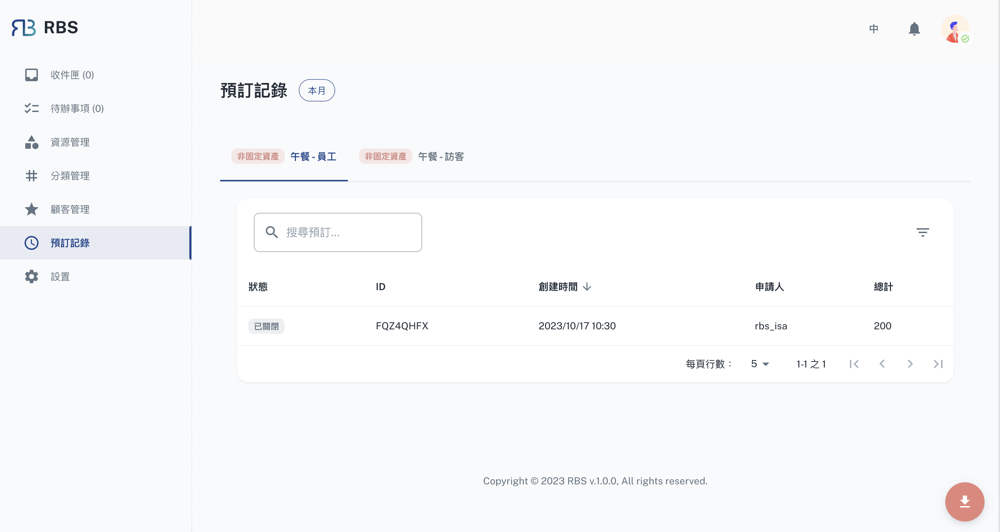

import BrowserWindow from '@site/src/components/BrowserWindow'

export const url = 'https://rbs.ces.myfiinet.com/rbs-admin/bookings'

<BrowserWindow url={url}>

</BrowserWindow>

Administrators can easily access detailed information about all booked resources within the Bookings section. This feature offers an organized list of bookings, enabling quick and convenient access to essential details such as the booked resource, date, time, and user/customer information. This view allows administrators to monitor resource utilization effectively.

## Functions

- 📁 Filtering Options:

  - To further enhance the reporting capabilities, the Bookings section offers filtering options. Administrators can apply various filters to narrow down the report data. This may include filtering by resource type and date range. These filters help administrators extract relevant insights and make data-driven decisions based on the criteria that matter most to the organization.

- 📊 Exporting Reports:
  - One of the standout features of the Bookings section is the ability to export reports. Administrators can generate detailed reports containing booking information, which is invaluable for tracking resource usage, assessing demand, and making informed decisions. These reports can be customized to include specific data fields, allowing administrators to focus on the information that matters most.
