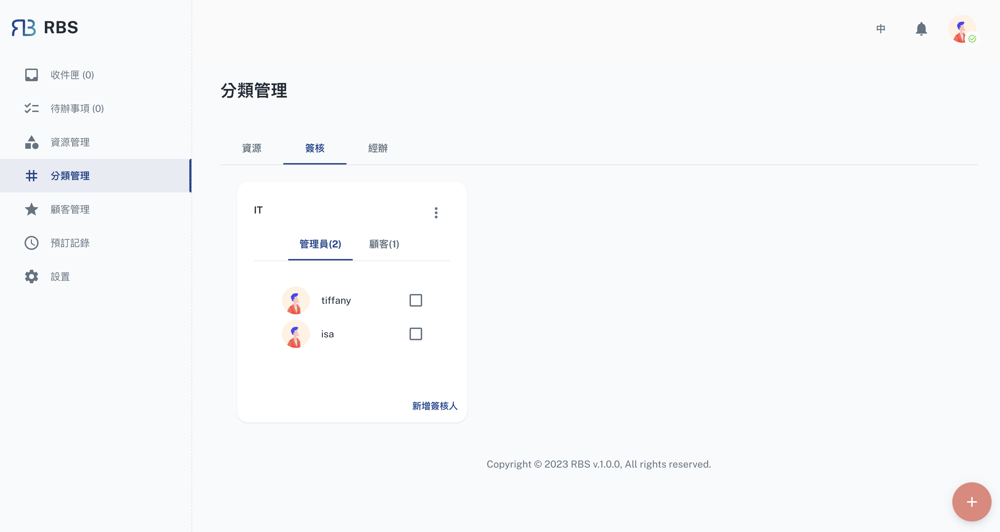

import Tabs from '@theme/Tabs'
import TabItem from '@theme/TabItem'

import BrowserWindow from '@site/src/components/BrowserWindow'

export const url = 'https://rbs.ces.myfiinet.com/rbs-admin/group-management'

<BrowserWindow url={url}>

</BrowserWindow>

The Group Management section within the RBS Admin Portal is a central hub for organizing and configuring groups that have a significant impact on resource approvals. This feature empowers administrators to effectively Create, Read, Update, and Delete (CRUD) groups, enhancing the control and coordination of resource allocation.

---

## Functions

<Tabs>
  <TabItem value="resource" label="Resource">

🚧 Developing...

  </TabItem>
  <TabItem value="approval" label="Approval" default>

  <BrowserWindow url={url}>

</BrowserWindow>

- ➕ Create:

  - Administrators can easily create new groups within the Group Management section. These groups serve as a means of organizing **site users** and **customers** for streamlined resource approvals. When creating a group, administrators can specify a group name, description, and associated members. These groups play a pivotal role in the resource approval process, ensuring that the right individuals are involved in decision-making.

- 🖊️ Update:

  - Once groups are created, administrators can manage them efficiently. This includes viewing the details and members of existing groups, which is especially useful for understanding the composition of each group and its role in the approval process. Administrators can also update group details or add/remove members as needed, allowing for adaptability and ensuring that groups are aligned with the organization's current requirements.

- ❌ Delete:
  - In addition to creating and managing groups, administrators also have the ability to delete groups when they are no longer needed. This feature ensures that the list of groups remains well-organized and clutter-free. When a group is deleted, it is removed from the system, streamlining the group management process.

Groups created within Group Management play a crucial role in the resource approval workflow. They can be assigned as approver groups for specific resources, enabling a structured and collaborative approach to approving resource bookings. These groups can include both site users and customers, ensuring that the right stakeholders are involved in the decision-making process.

  </TabItem>
    <TabItem value="executer" label="Executer">

🚧 Developing...

  </TabItem>
</Tabs>
