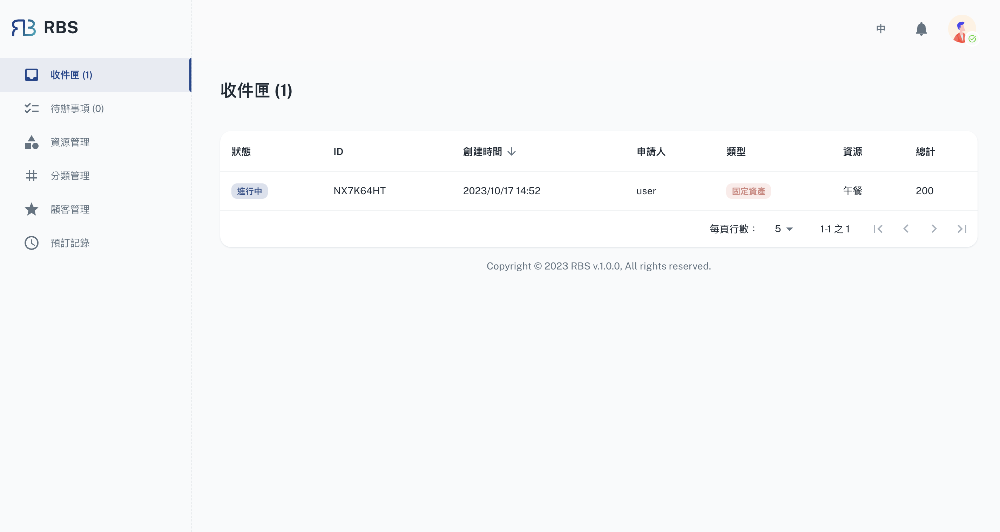

import BrowserWindow from '@site/src/components/BrowserWindow'

export const url = 'https://10.62.172.106/rbs-admin/inbox'

<BrowserWindow url={url}>

</BrowserWindow>

Within the Inbox section of the RBS Admin Portal, you will find a dedicated area for managing booking requests that require your approval. Here, you can efficiently oversee and respond to booking requests submitted by users. The Inbox streamlines the approval process, ensuring that resource allocation remains controlled and conflict-free.

# Description

Upon entering the Inbox, you'll encounter a table displaying booking tickets, each representing a request from a user. These booking tickets provide essential details about the reservation, including the requested resource, date, and time. You can easily review these tickets and make informed decisions about whether to approve or reject the applicant's request.

Clicking on a booking ticket opens a dialog box, offering you a more comprehensive view of the request. In this dialog, you'll have the power to make a choice: **'Agree'** to approve the applicant's request and finalize the booking, or **'Reject'** to decline the request.

The Inbox in the RBS Admin Portal simplifies the approval process, ensuring that you have full control over resource allocation and that every booking aligns with your organization's policies and availability. It's a powerful tool that makes managing and responding to booking requests a seamless and straightforward process.

<BrowserWindow url={url}>

</BrowserWindow>
