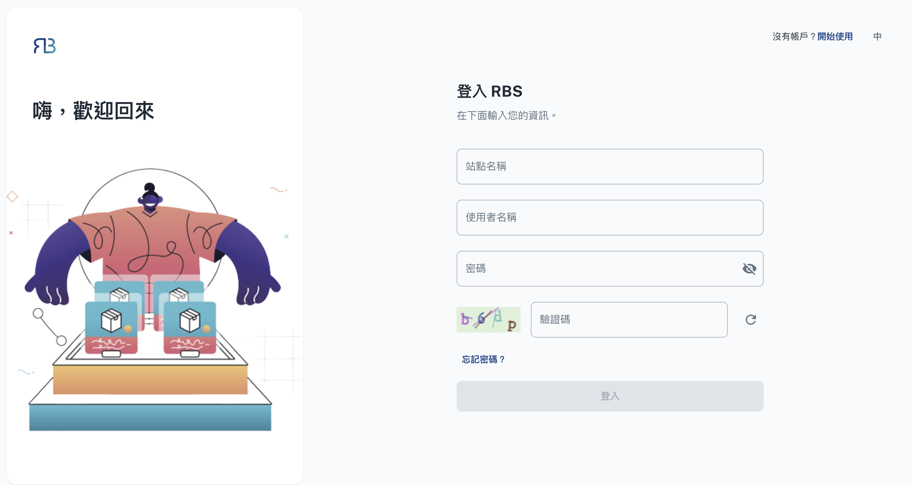

import BrowserWindow from '@site/src/components/BrowserWindow'

export const url = 'https://10.62.172.106/rbs-admin/login'

<BrowserWindow url={url}>

</BrowserWindow>

Welcome to the RBS Admin Portal, the command center for seamless resource management within your organization. As an administrator, you hold the key to optimizing resource allocation, resolving conflicts, and ensuring the efficient use of your assets. The Admin Portal offers advanced tools and insights that empower you to oversee and control resource allocation effectively. From managing user access to generating reports and tracking resource utilization, this portal puts you in the driver's seat. This guide will provide you with a comprehensive understanding of the Admin Portal's features, enabling you to make resource management a well-oiled machine.
