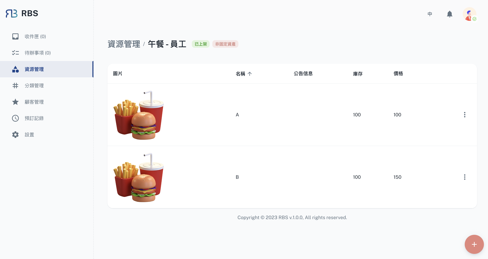

import Tabs from '@theme/Tabs'
import TabItem from '@theme/TabItem'

import BrowserWindow from '@site/src/components/BrowserWindow'

export const url = 'https://10.62.172.106/rbs-admin/resource-management'

<BrowserWindow url={url}>

</BrowserWindow>

Resource Management is the heart of the RBS Admin Portal, where you have full control over your organization's valuable assets. This section empowers you to add, edit, and organize resources efficiently. You can define resource availability, set rules and permissions, and optimize resource allocation to eliminate scheduling conflicts and maximize utilization.

---

## Functions

<Tabs>
  <TabItem value="basic" label="Basic Info" default>

<BrowserWindow url={url}>

</BrowserWindow>

In the 'Basic Info' section, administrators can configure key resource attributes. This includes setting the **'Release Status'** to determine when users can book the resource, specifying the resource's **name**, displaying important **bulletin messages**, uploading **image** to provide a visual reference, and defining the resource **type** as either **'Unfixed Asset'** or **'Fixed Asset.'** These settings are essential for ensuring that your resources are appropriately identified and accessible to users.

  </TabItem>
  <TabItem value="announcement" label="Announcement">

  <BrowserWindow url={url}>

</BrowserWindow>

The 'Announcement' section empowers administrators to communicate essential information related to the resource. Here, you can configure parameters like the 'Default Booking Time' to define how bookings are initiated, specify 'Excluded Holidays' to manage resource availability during holidays, set the 'Booked in Advance' timeframe, and attach important documents or 'Attachments' for users to reference. These features enhance resource transparency and help users understand resource-specific guidelines and policies.

  </TabItem>
    <TabItem value="statement" label="Statement">

<BrowserWindow url={url}>

</BrowserWindow>

The 'Statement' section provides administrators with the ability to outline details about the resource's usage and procedures. This includes configuring 'Daily Recurring Settlement,' streamlining the process of reconciling resource usage and settlements. This is particularly useful for tracking and managing ongoing usage.

  </TabItem>
    <TabItem value="process" label="Process">

<BrowserWindow url={url}>

</BrowserWindow>

In the 'Process' section, administrators can further customize the resource management workflow. This includes the option to 'Enable Approval Process' to ensure that specific bookings require approval before confirmation, enhancing control over resource allocation. Additionally, administrators can 'Unify Transactor Handle,' simplifying the management of bookings and resources. These features help maintain consistency and efficiency in the allocation process.

  </TabItem>
    <TabItem value="identity" label="Enroll Identity">

<BrowserWindow url={url}>

</BrowserWindow>

This section helps you manage enrollment criteria and user access to the resource, ensuring that the right individuals or groups can book and use it.

  </TabItem>
</Tabs>

---

## Items

In the RBS Admin Portal's Resource Management section, administrators have the capability to manage not only the resources themselves but also the individual items associated with those resources. This feature provides a comprehensive view and control over the items connected to a resource, enhancing the organization's ability to monitor and maintain its assets.

Administrators can easily access a resource's associated items by clicking on the respective row in the table within the Resource Management interface. This action provides direct access to the items linked to the selected resource, allowing for in-depth management and oversight.

<BrowserWindow url={url}>

</BrowserWindow>

### CRUD

Within the 'Items' section, administrators can perform a range of CRUD operations (Create, Read, Update, Delete) to maintain the resource's individual components. These operations include:

- ➕ Create: Administrators can add new items to the resource, specifying details such as item name, stock, price, and any other relevant information.

- 👀 Read: The 'Read' functionality enables administrators to view detailed information about each item, including its attributes, status, and associated data.

- 🖊️ Update: Administrators can modify item details as needed, ensuring that the information remains accurate and up to date. This includes the ability to adjust quantities, update conditions, or make other relevant changes.

- ❌ Delete: If an item is no longer in use or needs to be removed from the resource, administrators can easily delete it from the resource's item list, ensuring a well-organized and up-to-date inventory.

The ability to manage resource items not only enhances asset tracking and maintenance but also contributes to efficient resource allocation. It allows administrators to ensure that the resource's components are in optimal condition and readily available for users. The 'Items' section simplifies the process of managing and maintaining the individual elements that make up the resource, providing a comprehensive solution for resource management within your organization.
