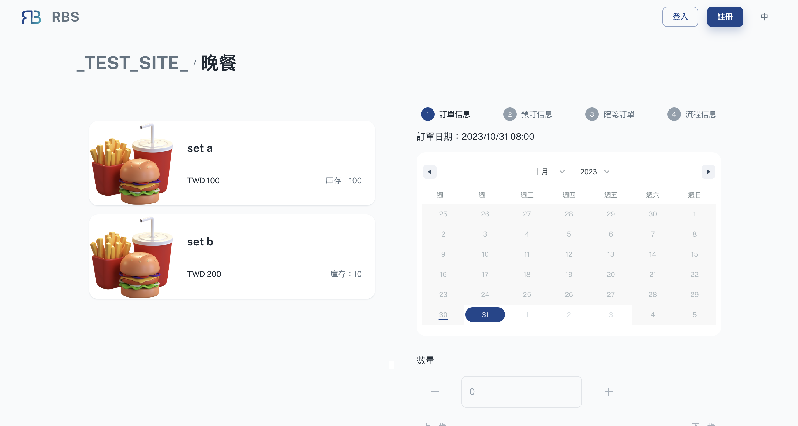
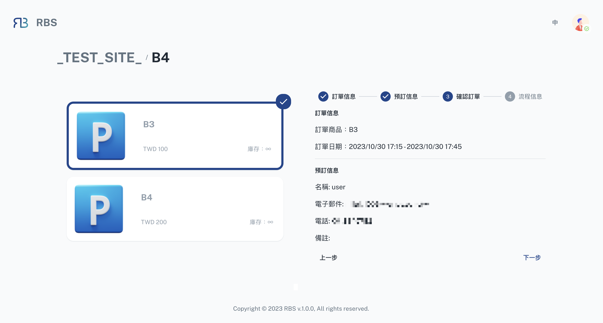

import Tabs from '@theme/Tabs'
import TabItem from '@theme/TabItem'

import BrowserWindow from '@site/src/components/BrowserWindow'

export const url = 'https://10.62.172.106/rbs'

<BrowserWindow url={url}>

</BrowserWindow>

After selecting a resource, you'll be directed to the booking page, where you can easily reserve your chosen asset. This page is divided into two key sections:

---

- 🍎 **Item List**

  In the first section, the 'Item List,' you can view the available items associated with the resource. You can select one item from the list, ensuring that you choose the specific component you need for your reservation. This section simplifies the process of item selection, making it easy to specify the exact equipment or resource you require for your activities.

---

- ℹ️ **Info Section** with Steps

  The second section, the 'Info Section,' guides you through the booking process in three steps (**_or four if approvals are required_**):

<Tabs>
  <TabItem value="order" label="Order Info" default>

<BrowserWindow url={url}>

</BrowserWindow>

In this step, you'll choose the date, time, and quantity for your reservation. This step lays the foundation for your booking, ensuring that you specify when and how many of the resource you need.

  </TabItem>
  <TabItem value="reserve" label="Reserve Info">

  <BrowserWindow url={url}>

</BrowserWindow>

The 'Reserve Info' step provides you with the choice to book as either a  site member (if logged in) or a guest.

  </TabItem>
    <TabItem value="confirm" label="Confirm Order">

<BrowserWindow url={url}>

</BrowserWindow>

This step is all about confirming your booking. It allows you to review your selections and ensure that all the details are accurate. It's the final step before confirming your reservation.

  </TabItem>
    <TabItem value="process" label="Process Info (Optional)">

<BrowserWindow url={url}>

</BrowserWindow>

If your reservation requires approvals, you'll find the 'Process Info' step at the end. In this step, you can select the approver for your booking, ensuring that your request is reviewed and authorized as necessary.

  </TabItem>
</Tabs>
