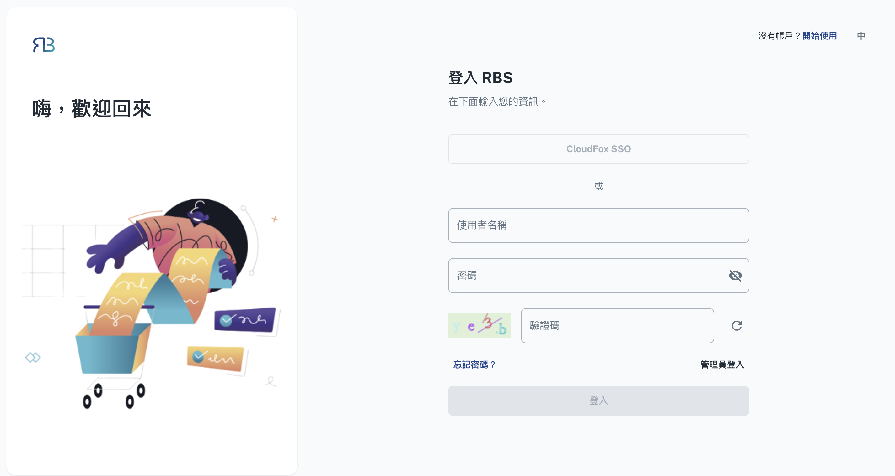

import BrowserWindow from '@site/src/components/BrowserWindow'

export const url = 'https://rbs.ces.myfiinet.com/rbs/login'

<BrowserWindow url={url}>

</BrowserWindow>

Welcome to the RBS User Portal, your gateway to efficient and hassle-free resource management. This portal is designed with simplicity and user-friendliness in mind, allowing you to easily book and manage resources to support your daily tasks and activities. Whether you need to reserve a meeting room, equipment, or any other valuable asset, the User Portal empowers you to do so with just a few clicks. Say goodbye to the complexities of resource coordination and scheduling conflicts. In this guide, we will walk you through how to maximize your experience and productivity using the RBS User Portal.
