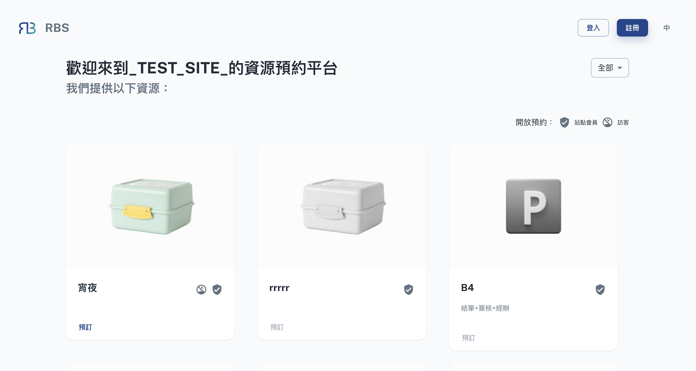

import BrowserWindow from '@site/src/components/BrowserWindow'

export const url = 'https://10.62.172.106/rbs'

<BrowserWindow url={url}>

</BrowserWindow>

:::tip Once you've chosen a site and entered, you'll find resources identified by icons:

verified_user For 
  Site Members

: Exclusive to registered site members.  
account_circle_off For 
  Guests

: Open to everyone.

:::

- 🌍 Browse and Explore

  Upon entering the site page, you'll find a user-friendly interface that presents a list of all the resources associated with the chosen site. You can browse through this list to explore the resources in detail. Each resource is accompanied by relevant information such as its name, description, availability, and any additional details that are relevant to its use.

- 🔎 Filter and Sort

  To make resource discovery even more convenient, you can often use filter and sorting options. These features allow you to narrow down the list of resources based on specific criteria, such as resource type, availability, capacity, or any other relevant parameters. By using filters and sorting, you can quickly identify the resources that best meet your needs.

- 🗒️ Resource Details

  Clicking on a specific resource within the site page provides access to more detailed information. You can view additional information about the resource, including any specific rules, requirements, or guidelines associated with its use. This ensures that you have all the information you need to make an informed booking decision.

- 🚀 Initiate Booking
  When you've found the resource you'd like to book, you can often initiate the booking process directly from the site page. This typically involves selecting a date and time for your reservation, along with any other necessary details.
