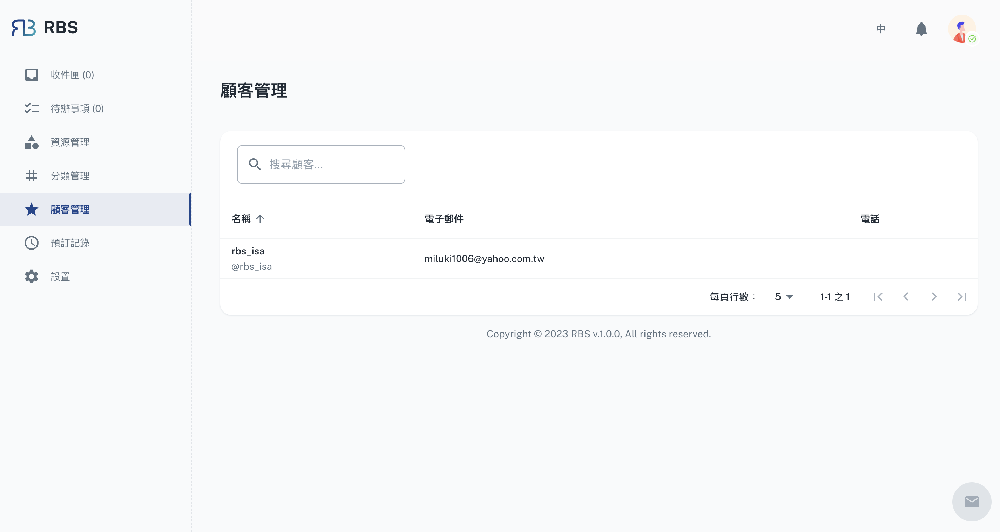

import BrowserWindow from '@site/src/components/BrowserWindow'

export const url = 'https://10.62.172.106/rbs-admin/customer-management'

<BrowserWindow url={url}>

</BrowserWindow>

RBS 管理后台中的顾客管理部分为管理员提供了存取和查看与资源预订相关的顾客资讯。此功能提供了基本顾客详细资讯，包括他们的姓名、帐户、电子邮件和电话号码。

---

管理员可以轻松存取和查看在网站上进行资源预订的顾客的个人资讯。这包括顾客姓名、帐户资讯、电子邮件地址和电话号码等详细资讯。

存取和查看顾客资讯的能力对于与使用资源预订系统的使用者和顾客保持清晰有效的沟通至关重要。它确保管理员拥有必要的联络方式，以满足任何沟通或支援需求。
