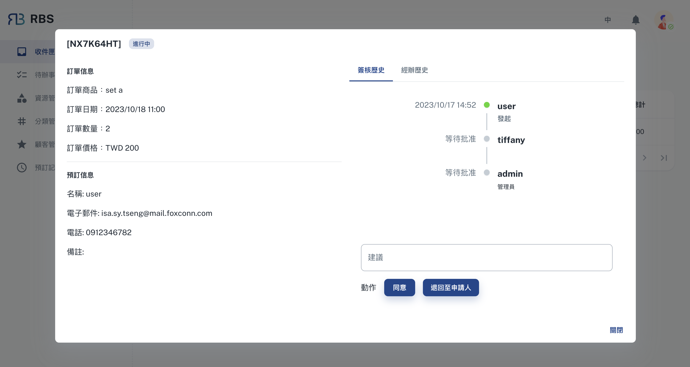

import BrowserWindow from '@site/src/components/BrowserWindow'

export const url = 'https://rbs.ces.myfiinet.com/rbs-admin/inbox'

<BrowserWindow url={url}>

</BrowserWindow>

在 RBS 管理员后台的收件匣部分中，您将找到一个专门区域，用于管理需要您审核的预订请求。在这里，您可以有效地监督和回应用户提交的预订请求。收件匣简化了审核流程，确保资源分配保持受控且无冲突。

---

进入收件匣后，您将看到一个显示预订申请单的表格，每张申请单代表来自顾客（员工）的预订。这些预订申请单提供了有关预订的重要详细信息，包括请求的资源、日期和时间。您可以轻松查看这些申请单，并同意或拒绝申请人的预订。

点击预订申请单会开启一个对话框，为您提供更全面的预订申请单。在此对话方块中，您有权做出选择：**「同意」** 批准申请人的请求并完成预订，或 **「拒绝」** 预订。

<BrowserWindow url={url}>

</BrowserWindow>
