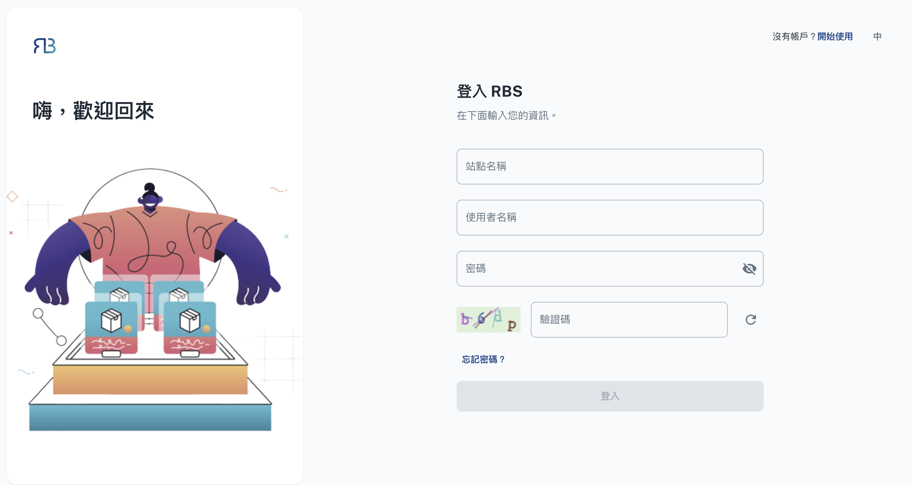

import BrowserWindow from '@site/src/components/BrowserWindow'

export const url = 'https://10.62.172.106/rbs-admin/login'

<BrowserWindow url={url}>

</BrowserWindow>

欢迎来到 RBS 管理员后台，这是您组织内无缝资源管理的指挥中心。身为管理员，您掌握着优化资源分配、解决冲突并确保资产有效利用的关键，使您能够有效地监督和控制资源分配。从管理用户存取到产生报告和追踪资源利用率，该后台让您处于主导地位。本指南将使您全面了解管理后台的功能。
