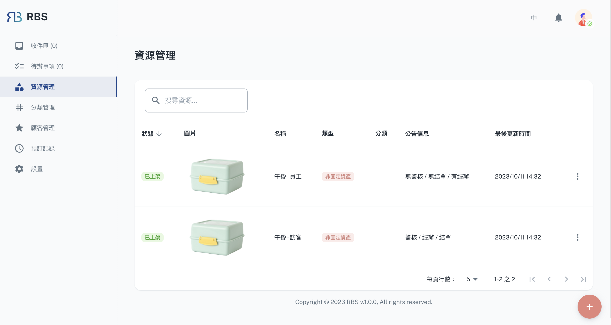
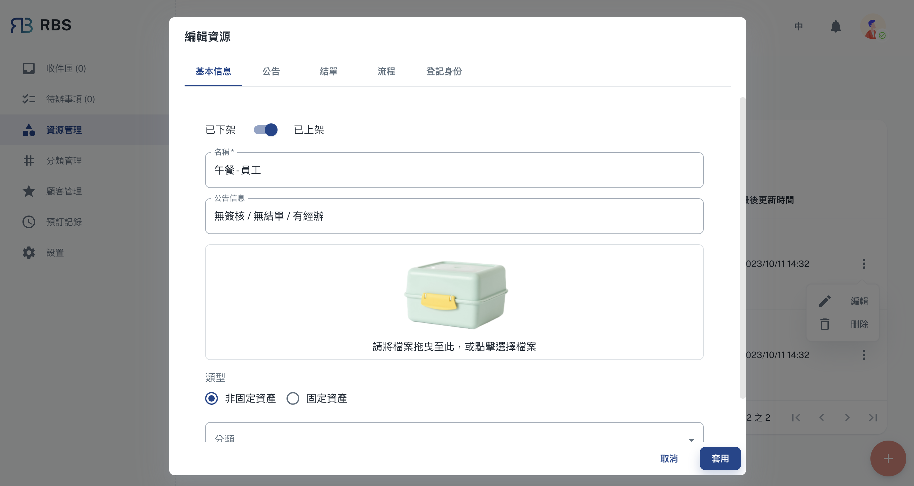
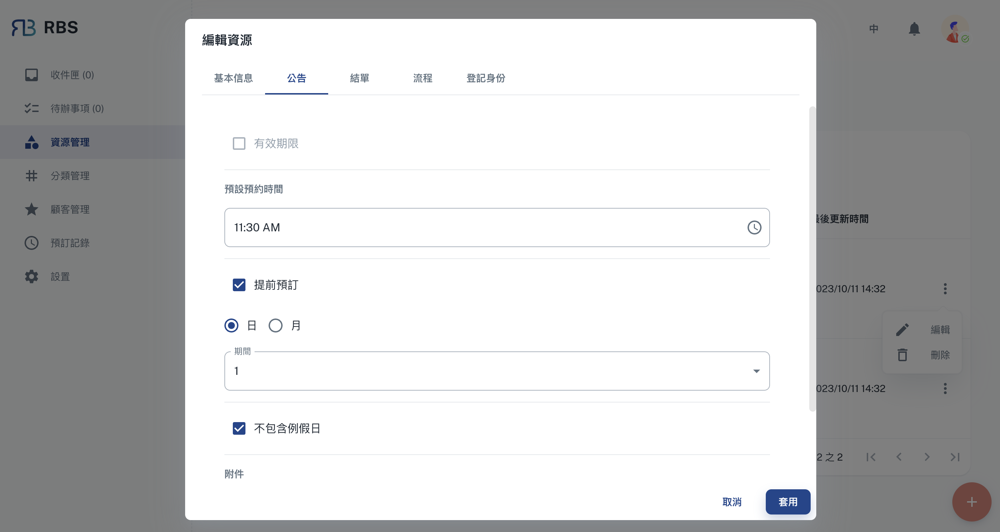
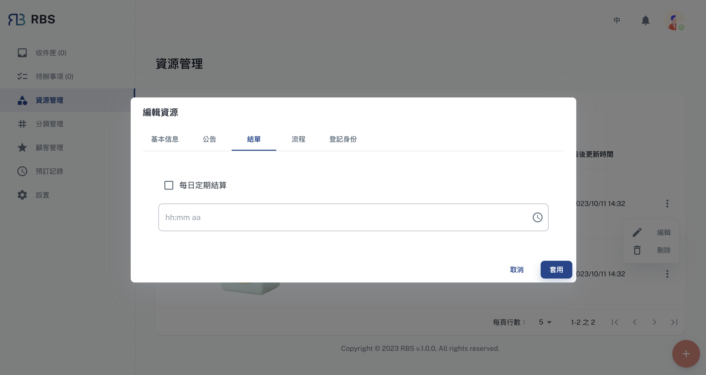
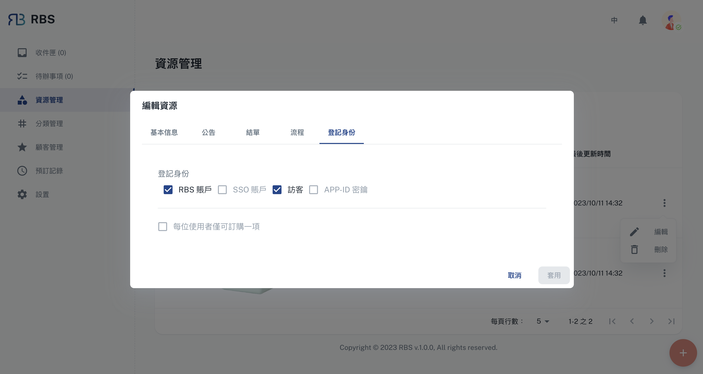
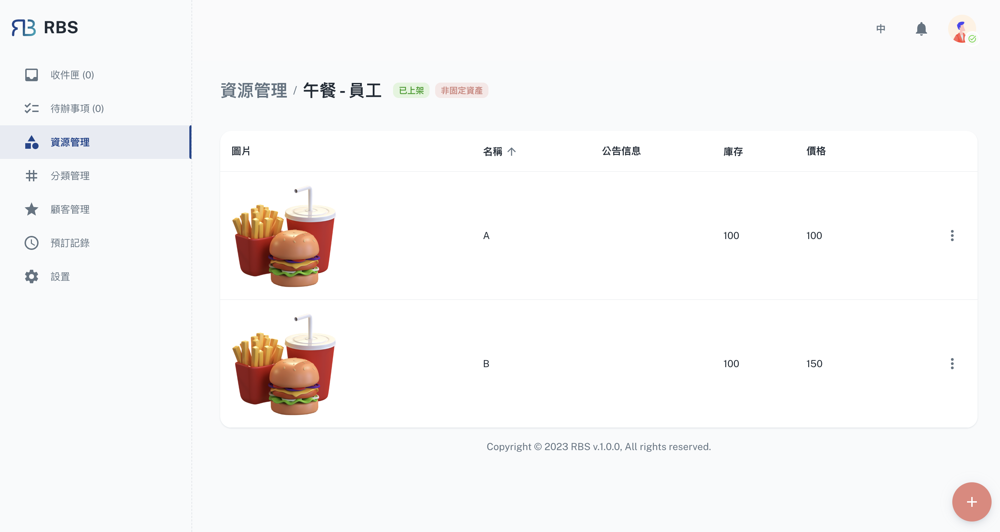

import Tabs from '@theme/Tabs'
import TabItem from '@theme/TabItem'

import BrowserWindow from '@site/src/components/BrowserWindow'

export const url = 'https://10.62.172.106/rbs-admin/resource-management'

<BrowserWindow url={url}>

</BrowserWindow>

资源管理是 RBS 管理员后台的核心，您可以在其中完全控制组织的宝贵资产。此部分使您能够有效地新增、编辑和组织资源。您可以定义资源可用性、设定规则和权限并最佳化资源分配，以消除调度冲突并最大限度地提高使用率。

---

## 功能

<Tabs>
  <TabItem value="basic" label="基本信息" default>

<BrowserWindow url={url}>

</BrowserWindow>

在「基本信息」部分，管理员可以配置关键资源属性。这包括设定**「发布状态」**以确定用户何时可以预订资源、指定资源的**名称**、显示重要的**公告讯息**、上传**图像**以提供视觉参考，并将资源**类型**定义为**「未固定资产」**或**「固定资产」**。这些设定可以确保顾客（员工）正确识别并存取您的资源。

  </TabItem>
  <TabItem value="announcement" label="公告">

  <BrowserWindow url={url}>

</BrowserWindow>

「公告」部分使管理员能够设定资源相关的时间设定。在这里，您可以配置“预设预订时间”等参数来定义如何启动预订，指定“不包含例假日”来管理假期期间的资源可用性，设定“提前预订”时间范围，并添加“附件”供使用者参考。这些功能增强了资源透明度，并帮助使用者了解特定资源。

  </TabItem>
    <TabItem value="statement" label="结单">

<BrowserWindow url={url}>

</BrowserWindow>

「结单」部分使管理员能够设定有关资源的结单时间。这包括配置“每日定期结算”，简化协调资源使用和结算的流程。

  </TabItem>
    <TabItem value="process" label="流程">

<BrowserWindow url={url}>

</BrowserWindow>

在「流程」部分，管理员可以进一步自订资源的工作流程。这包括「启用签核流程」选项，以确保特定预订在确认前需要签核，从而增强对资源分配的控制。此外，管理员可以启动“统一经办人办理”，简化预订和资源的管理。这些功能有助于维持分配过程的一致性和效率。

  </TabItem>
    <TabItem value="identity" label="登记身分">

<BrowserWindow url={url}>

</BrowserWindow>

本部分可协助您管理资源的存取权限，确保正确的个人或团体可以预订和使用它。

  </TabItem>
</Tabs>

---

## 品项

在 RBS 管理员后台的资源管理部分，管理员不仅能够管理资源本身，还能够管理与这些资源相关的各个品项。

管理员可以透过点击资源管理介面中表格中的对应行轻松存取资源的品项。

<BrowserWindow url={url}>

</BrowserWindow>

### 增删改查

在「品项」部分中，管理员可以执行一系列 CRUD 操作（建立、读取、更新、删除）来维护资源的各个品项。这些操作包括：

- ➕ 建立

  管理员可以向资源新增品项，指定品项名称、库存、价格和任何其他相关资讯等详细资讯。

- 👀 读取

  「读取」功能使管理员能够查看有关每个品项的详细信息，包括其属性、状态和关联数据。

- 🖊️ 更新

  管理员可以根据需要修改品项详细信息，确保资讯保持准确和最新。这包括调整数量、更新条件或进行其他相关更改的能力。

- ❌ 删除

  如果某个品项不再使用或需要从资源中删除，管理员可以轻松地将其从资源的品项清单中删除，从而确保库存组织良好且最新。

管理资源品项的能力不仅可以增强资产追踪和维护，还有助于高效率的资源分配。它允许管理员确保资源的品项处于最佳状态并且可供使用者随时使用。
