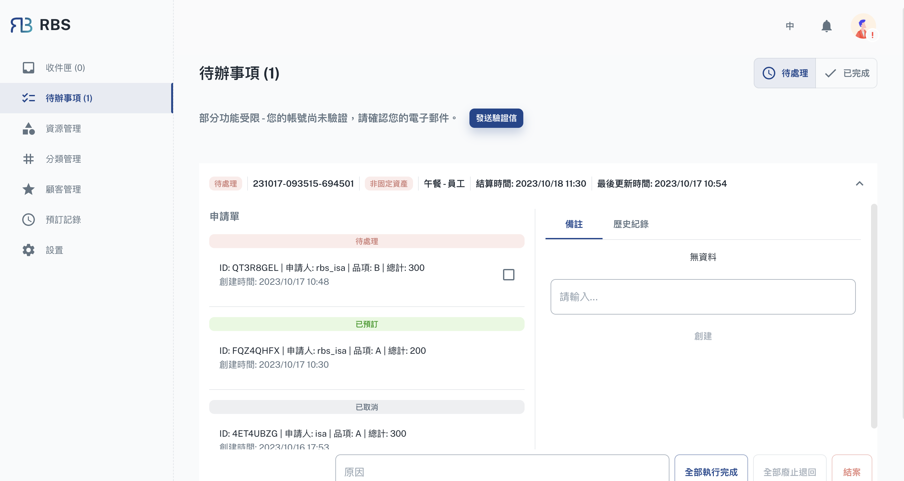

import BrowserWindow from '@site/src/components/BrowserWindow'

export const url = 'https://rbs.ces.myfiinet.com/rbs-admin/todo'

<BrowserWindow url={url}>

</BrowserWindow>

欢迎来到 RBS 管理后台的待办事项部分，这是您管理与预订交付相关作业的控制中心。在此部分中，您将找到一个「工作」列表，每个工作代表需要您关注的预订单的集合。这些工作包括协调和结算多个预订，以确保高效的资源利用。

---

作为管理员，您可以灵活地查看这些工作并对其采取操作。当您打开工作时，您可以访问有关所包含预订的详细信息，例如请求的资源、计划时间和结算要求。这些详细资讯使您能够做出明智的决策，并确保组织的资源分配顺利进行。

待办事项部分的独特之处在于能够在每个作业中添加和管理注释。管理员可以在工作中附加注释，提供基本资讯、说明或评论。这些注释可以为您和您的团队提供更多的资讯，改善沟通并让每个人步调保持一致。

此外，「待办事项」部分也维护每项作业的所有操作历史记录。这些历史记录包括例如**执行**、**删除**或**完成**作业中的预订。它提供了工作进展和活动的清晰且有条理的记录，确保资源管理的透明度。
