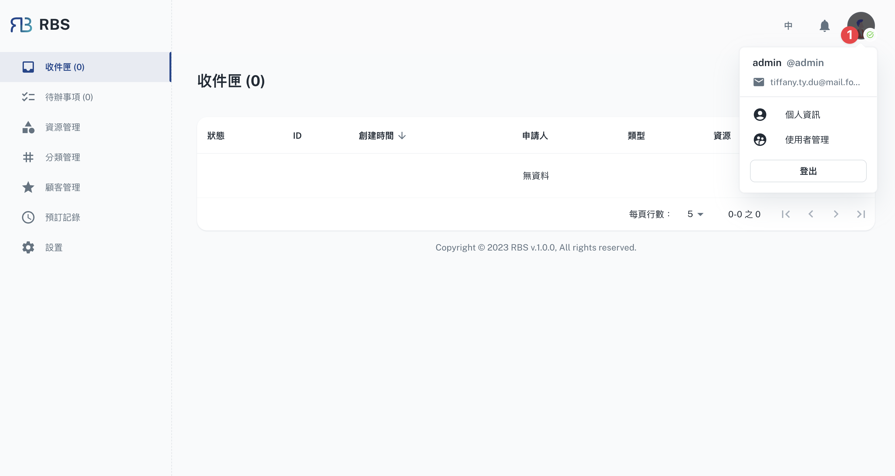
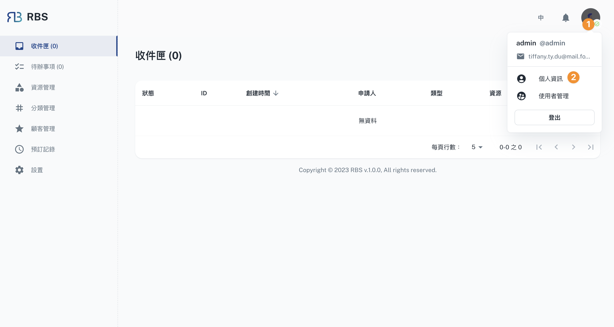
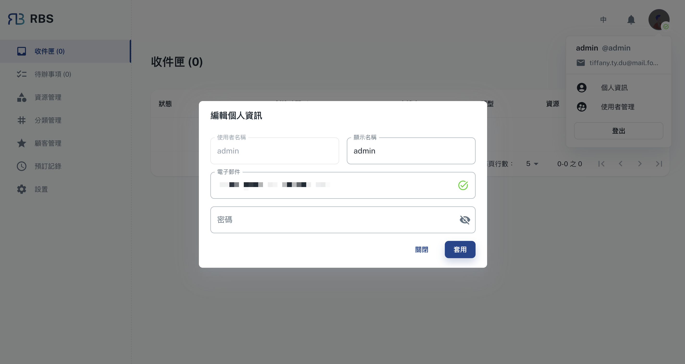
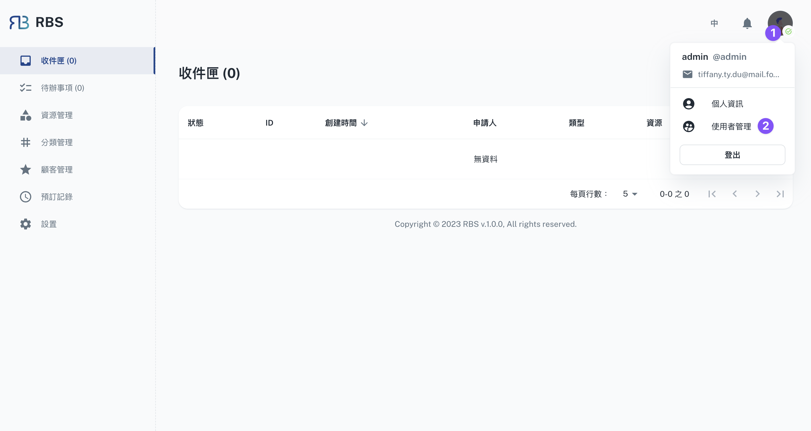

import BrowserWindow from '@site/src/components/BrowserWindow'

export const url = 'https://10.62.172.106/rbs-admin/user-management'

<BrowserWindow url={url}>

</BrowserWindow>

:::tip 请先验证电子邮件
:::

使用者可以透过点击视窗右上角的头像来存取他们的资讯。这将显示一个弹出式选单，其中显示使用者的使用者名称、权限和电子邮件。此外，使用者还可以在选单下方找到个人资讯以及使用者管理的选项。

---

## 目前使用者

「个人资讯」对话方块允许使用者修改其个人资讯，例如：

- 使用者名称
- 电子邮件地址
- 密码

<BrowserWindow url={url}>

</BrowserWindow>

<BrowserWindow url={url}>

</BrowserWindow>

---

## 使用者管理

「使用者管理」页面使用户能够新增使用者作为管理员或一般使用者。

管理员拥有对各种功能执行 CRUD（建立、读取、更新、删除）操作的完全授权。

一般使用者只有读取资讯的权限。

<BrowserWindow url={url}>

</BrowserWindow>

<BrowserWindow url={url}>

</BrowserWindow>

### 新增

要建立用户，需要以下栏位：

- 使用者名称
- 电子邮件地址
- 密码

### 编辑

当使用者点击「更多」选单中的「编辑」时，将在对话方块中显示相关使用者的可编辑资讯。所有显示的栏位都可以编辑。

### 删除

当使用者点击「更多」选单中的「删除」时，将显示一个警告对话框，以仔细检查并提醒使用者删除操作是不可逆的。
