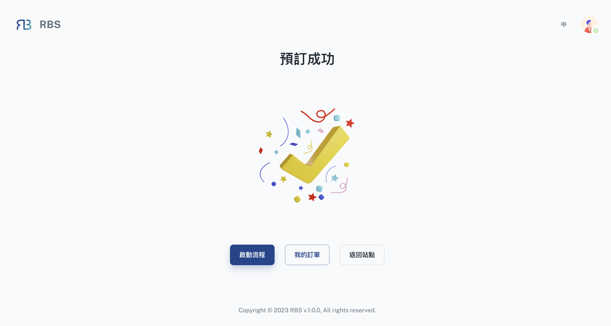

import BrowserWindow from '@site/src/components/BrowserWindow'

export const url = 'https://10.62.172.106/rbs'

<BrowserWindow url={url}>

</BrowserWindow>

成功完成预订后，您将被引导至“预订结果页面”，您将在收到预订确认讯息。在这里，您有几个选择：

- **✅ 成功**或**❌ 失败** 确认：

  将清楚地表明您的预订是否成功或失败。成功意味着您的预订已被确认并可启动流程。

---

站点成员的选项：

如果您是站点成员，您将在视窗上看到以下三个按钮：

- **激活流程**

  如果您的预订需要激活，则此选项可用。点击「启动流程」将启动任何必要的步骤来完成您的预订流程。

- **我的订单**

  点击「我的订单」将引导您进入[后台](../user/dashboard)，特别是[我的订单](../user/dashboard/my-orders)部分。在这里，您可以查看和管理您的所有预订，确保您可以轻松存取您的预订记录和状态。

- **返回网站**

  如果您想继续浏览网站或查看更多资源，您可以透过点击「返回网站」返回网站主页。

---

访客的选项：{' '}

如果您以访客身分预订，您**_不会_**在视窗上看到「启动流程」按钮。请检查您的<mark>电子邮件</mark>是否有包含启动预订流程连结的讯息。此连结将指导您完成所有必要的步骤以完成您的预订。
