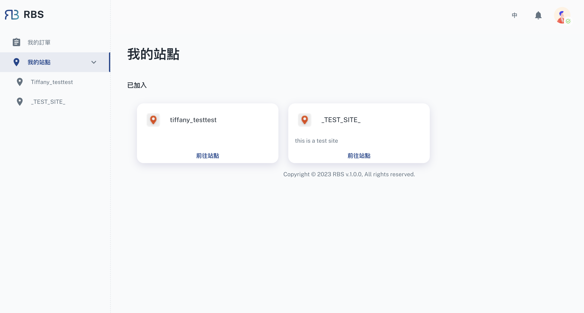

import BrowserWindow from '@site/src/components/BrowserWindow'

export const url = 'https://10.62.172.106/rbs/my-sites'

<BrowserWindow url={url}>

</BrowserWindow>

您可以在顾客（员工）后台中的「我的站点」部分中有效地管理与各个站点的互动。它提供了一个使用者友善的介面，用于追踪您的站点成员资格和任何待处理的站点请求。

- 🤝 查看已加入的站点

  在此部分中，您将找到已加入的站点的清单。每个站点都提供了基本信息，使您可以轻松识别和访问您的站点与其会员资格。要查看站点，您只需单击提供的按钮即可，该按钮会将您引导至该站点的专用页面。

- 🖖 待处理的站点请求

  如果您要求加入其他站点，这些待处理的请求会方便地显示在「我的站点」部分。对于每个待处理的站点请求，您可以选择查看请求详细资讯并追踪请求的进度。点击提供的按钮可让您存取与待处理请求相关的所有资讯。
