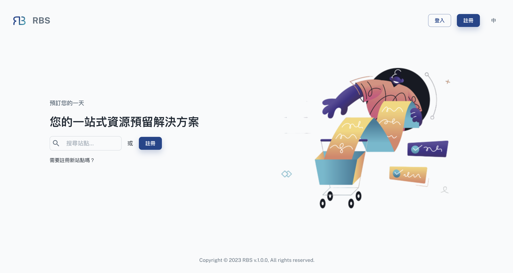

import BrowserWindow from '@site/src/components/BrowserWindow'

export const url = 'https://rbs.ces.myfiinet.com/rbs'

<BrowserWindow url={url}>

</BrowserWindow>

欢迎来到顾客（员工）入口，这是您高效资源管理的入口。顾客（员工）入口网站的登入页面是所有与资源相关的活动的起点。无论您是想要注册的新用户、管理员还是准备登入的现有用户，此页面都提供无缝且使用者友善的体验。

- 🔍 搜寻可用站点

  入口的主要功能之一是能够搜寻可用网站。用户可以轻松发现并浏览可用网站的清单。

- 👤 注册为管理员/用户

  如果您是系统新手或需要建立帐户，登入页面会提供使用者友善的注册流程。在这里，您可以根据需要选择注册为管理员或顾客（员工）。注册过程非常简单，让您可以立即开始资源管理。
