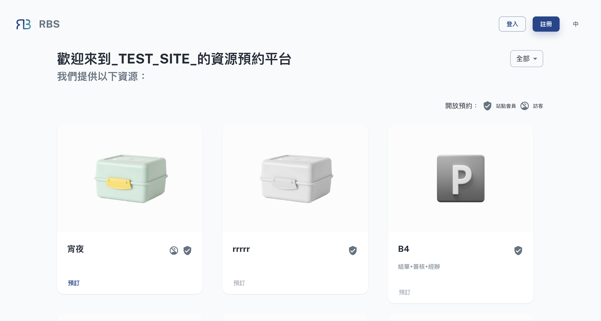

import BrowserWindow from '@site/src/components/BrowserWindow'

export const url = 'https://rbs.ces.myfiinet.com/rbs'

<BrowserWindow url={url}>

</BrowserWindow>

:::tip 一旦您选择并进入站点，您将找到由图示标识的资源：

verified_user 站点成员 :
仅限注册站点会员。   account_circle_off 
  {' '}
  访客{' '}
 ：开放给所有人。

:::

- 🌍 浏览和探索

  进入站点页面后，您会发现一个使用者友善的介面，其中显示与所选站点关联的所有资源的清单。您可以浏览此清单以详细探索资源。每个资源都附有相关信息，例如名称、描述、可用性以及与其使用相关的任何其他详细信息。

- 🔎 过滤和排序

  为了使资源发现更加方便，您通常可以使用筛选器和排序选项。这些功能可让您根据特定条件（例如资源类型、可用性、容量或任何其他相关参数）缩小资源清单的范围。透过使用筛选器和排序，您可以快速识别最能满足您需求的资源。

- 🗒️ 资源详情

  点击站点页面中的特定资源可以存取更详细的资讯。您可以查看有关资源的其他信息，包括与其使用相关的任何特定规则、要求或指南。这可确保您拥有做出明智的预订决定所需的所有资讯。
