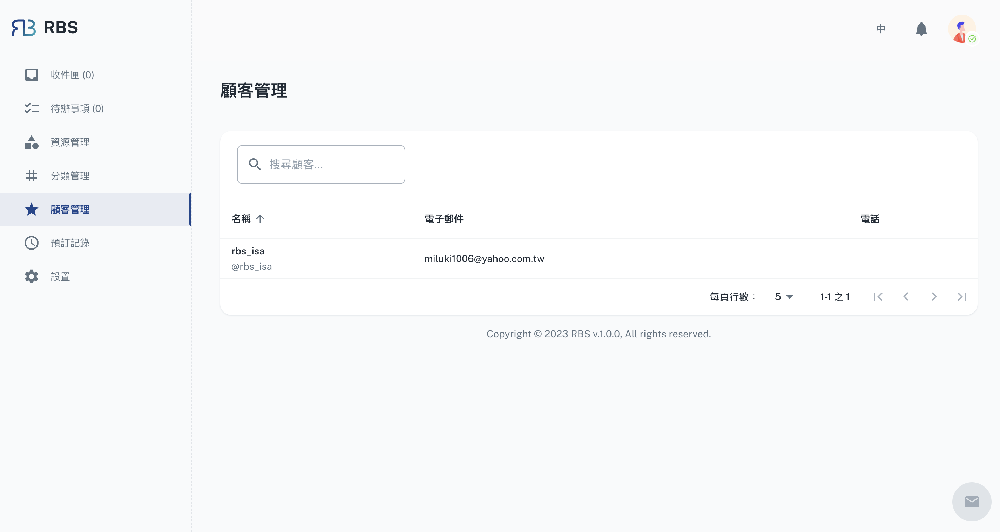

import BrowserWindow from '@site/src/components/BrowserWindow'

export const url = 'https://10.62.172.106/rbs-admin/customer-management'

<BrowserWindow url={url}>

</BrowserWindow>

RBS 管理後台中的顧客管理部分為管理員提供了存取和查看與資源預訂相關的顧客資訊。此功能提供了基本顧客詳細資訊，包括他們的姓名、帳戶、電子郵件和電話號碼。

---

管理員可以輕鬆存取和查看在網站上進行資源預訂的顧客的個人資訊。這包括顧客姓名、帳戶資訊、電子郵件地址和電話號碼等詳細資訊。

存取和查看顧客資訊的能力對於與使用資源預訂系統的使用者和顧客保持清晰有效的溝通至關重要。它確保管理員擁有必要的聯絡方式，以滿足任何溝通或支援需求。
