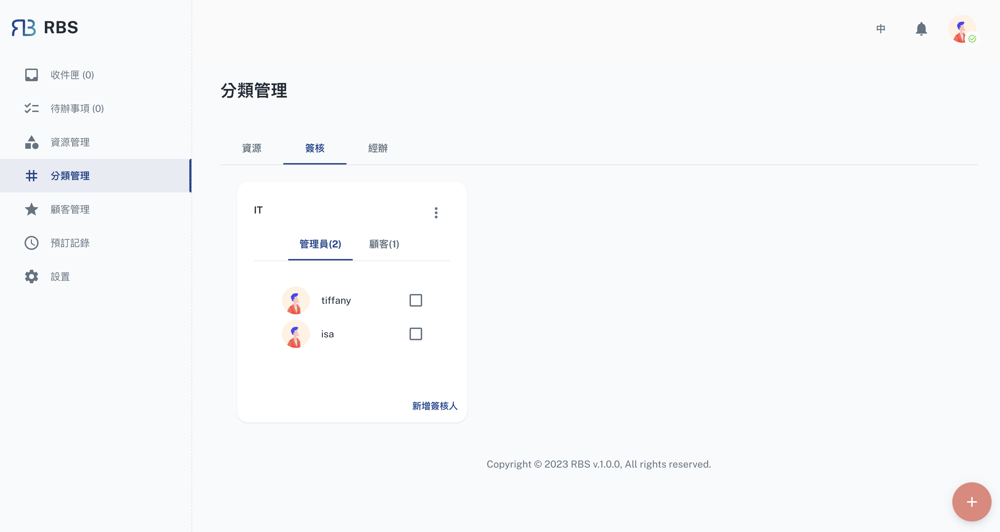

import Tabs from '@theme/Tabs'
import TabItem from '@theme/TabItem'

import BrowserWindow from '@site/src/components/BrowserWindow'

export const url = 'https://rbs.ces.myfiinet.com/rbs-admin/group-management'

<BrowserWindow url={url}>

</BrowserWindow>

RBS 管理員後台中的分類管理部分是組織和配置分類的中心。此功能使管理員能夠有效地建立、讀取、更新和刪除（CRUD）分類。

---

## 功能

<Tabs>
  <TabItem value="resource" label="資源">

🚧 開發中...

  </TabItem>
  <TabItem value="approval" label="簽核" default>

  <BrowserWindow url={url}>

</BrowserWindow>

- ➕ 創建:

  管理員可以在「分類管理」部分輕鬆建立新分類。這些分類是組織**管理員**和**客戶**的一種方式，以簡化資源簽核。建立分類時，管理員可以指定分類名稱、描述和關聯成員。這些分類在資源簽核過程中發揮關鍵作用，確保合適的人員參與決策。

- 🖊️ 編輯:

  建立分類後，管理員可以有效地管理它們。這包括查看現有分類的詳細資訊和成員，這對於了解每個分類的組成非常有用。管理員還可以更新分類詳細資訊或新增/刪除成員，從而實現適應性並確保分類符合組織的當前要求。

- ❌ 刪除:
  除了建立和管理分類之外，管理員還可以在不再需要時刪除分類。此功能可確保分類清單保持組織良好且整潔。刪除分類後，會將其從系統中刪除，從而簡化分類管理流程。

</TabItem>

  <TabItem value="executer" label="經辦">

🚧 開發中...

  </TabItem>
</Tabs>
