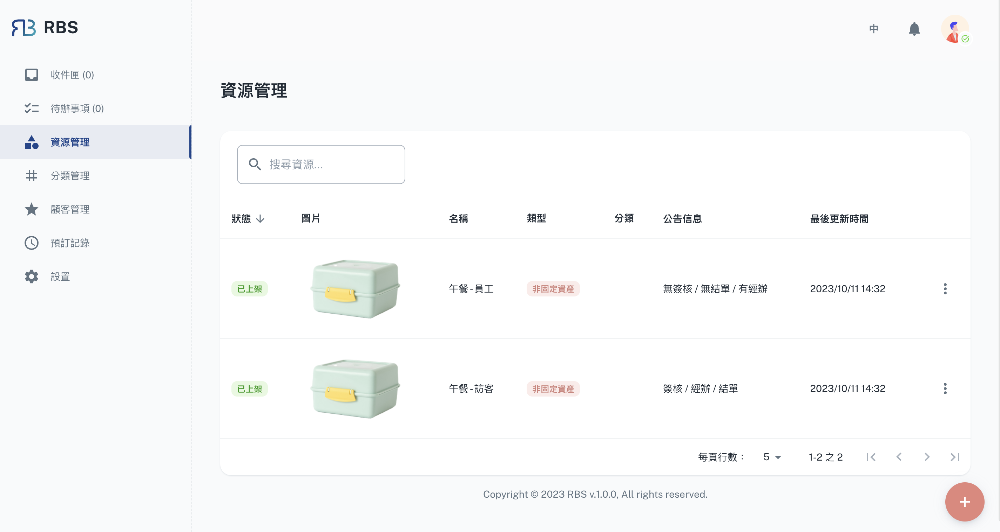
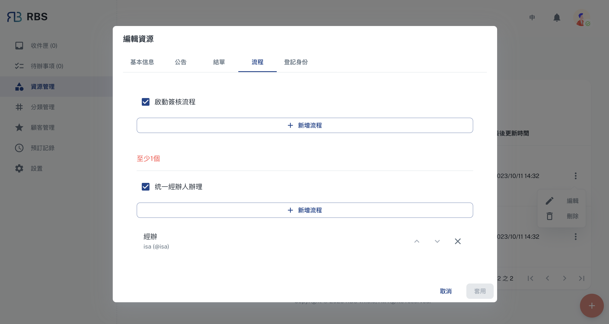
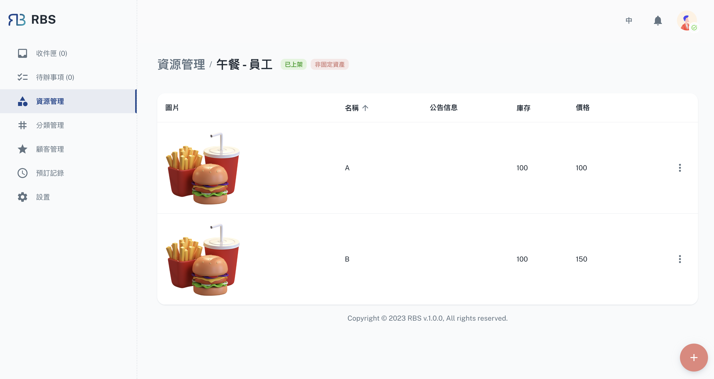

import Tabs from '@theme/Tabs'
import TabItem from '@theme/TabItem'

import BrowserWindow from '@site/src/components/BrowserWindow'

export const url = 'https://10.62.172.106/rbs-admin/resource-management'

<BrowserWindow url={url}>

</BrowserWindow>

資源管理是 RBS 管理員後台的核心，您可以在其中完全控制組織的寶貴資產。此部分使您能夠有效地新增、編輯和組織資源。您可以定義資源可用性、設定規則和權限並最佳化資源分配，以消除調度衝突並最大限度地提高使用率。

---

## 功能

<Tabs>
  <TabItem value="basic" label="基本信息" default>

<BrowserWindow url={url}>

</BrowserWindow>

在「基本信息」部分，管理員可以配置關鍵資源屬性。這包括設定**「發布狀態」**以確定用戶何時可以預訂資源、指定資源的**名稱**、顯示重要的**公告訊息**、上傳**圖像**以提供視覺參考，並將資源**類型**定義為**「未固定資產」**或 **「固定資產」**。這些設定可以確保使用者正確識別並存取您的資源。

  </TabItem>
  <TabItem value="announcement" label="公告">

  <BrowserWindow url={url}>

</BrowserWindow>

「公告」部分使管理員能夠設定資源相關的時間設定。在這裡，您可以配置“預設預訂時間”等參數來定義如何啟動預訂，指定“不包含例假日”來管理假期期間的資源可用性，設定“提前預訂”時間範圍，並添加“附件”供使用者參考。這些功能增強了資源透明度，並幫助使用者了解特定資源。

  </TabItem>
    <TabItem value="statement" label="結單">

<BrowserWindow url={url}>

</BrowserWindow>

「結單」部分使管理員能夠設定有關資源的結單時間。這包括配置“每日定期結算”，簡化協調資源使用和結算的流程。

  </TabItem>
    <TabItem value="process" label="流程">

<BrowserWindow url={url}>

</BrowserWindow>

在「流程」部分，管理員可以進一步自訂資源的工作流程。這包括「啟用簽核流程」選項，以確保特定預訂在確認前需要簽核，從而增強對資源分配的控制。此外，管理員可以啟動“統一經辦人辦理”，簡化預訂和資源的管理。這些功能有助於維持分配過程的一致性和效率。

  </TabItem>
    <TabItem value="identity" label="登記身分">

<BrowserWindow url={url}>

</BrowserWindow>

本部分可協助您管理資源的存取權限，確保正確的個人或團體可以預訂和使用它。

  </TabItem>
</Tabs>

---

## 品項

在 RBS 管理員後台的資源管理部分，管理員不僅能夠管理資源本身，還能夠管理與這些資源相關的各個品項。

管理員可以透過點擊資源管理介面中表格中的對應行輕鬆存取資源的品項。

<BrowserWindow url={url}>

</BrowserWindow>

### 增刪改查

在「品項」部分中，管理員可以執行一系列 CRUD 操作（建立、讀取、更新、刪除）來維護資源的各個品項。這些操作包括：

- ➕ 建立

  管理員可以向資源新增品項，指定品項名稱、庫存、價格和任何其他相關資訊等詳細資訊。

- 👀 讀取

  「讀取」功能使管理員能夠查看有關每個品項的詳細信息，包括其屬性、狀態和關聯數據。

- 🖊️ 更新

  管理員可以根據需要修改品項詳細信息，確保資訊保持準確和最新。這包括調整數量、更新條件或進行其他相關更改的能力。

- ❌ 刪除

  如果某個品項不再使用或需要從資源中刪除，管理員可以輕鬆地將其從資源的品項清單中刪除，從而確保庫存組織良好且最新。

管理資源品項的能力不僅可以增強資產追蹤和維護，還有助於高效率的資源分配。它允許管理員確保資源的品項處於最佳狀態並且可供使用者隨時使用。
