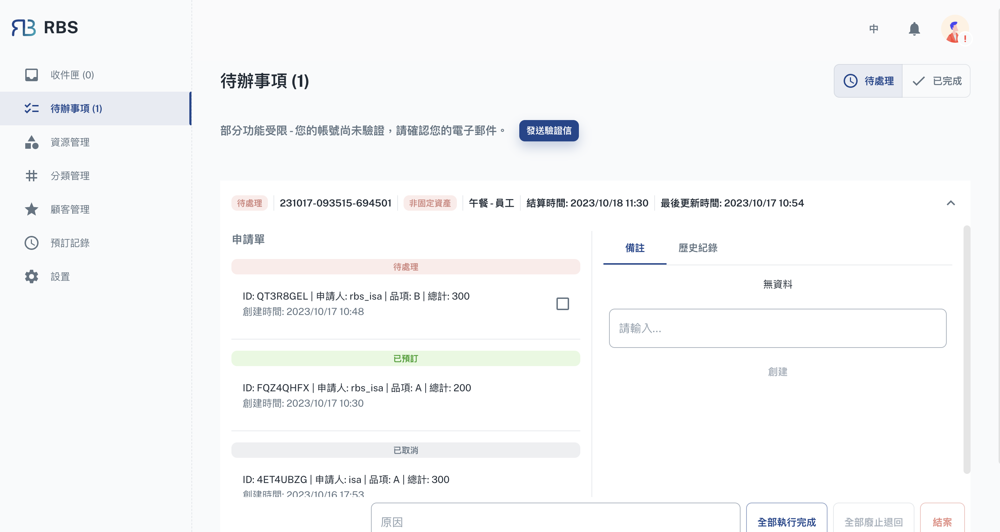

import BrowserWindow from '@site/src/components/BrowserWindow'

export const url = 'https://rbs.ces.myfiinet.com/rbs-admin/todo'

<BrowserWindow url={url}>

</BrowserWindow>

歡迎來到 RBS 管理後台的待辦事項部分，這是您管理與預訂交付相關作業的控制中心。在此部分中，您將找到一個「工作」列表，每個工作代表需要您關注的預訂單的集合。這些工作包括協調和結算多個預訂，以確保高效的資源利用。

---

作為管理員，您可以靈活地查看這些工作並對其採取操作。當您打開工作時，您可以訪問有關所包含預訂的詳細信息，例如請求的資源、計劃時間和結算要求。這些詳細資訊使您能夠做出明智的決策，並確保組織的資源分配順利進行。

待辦事項部分的獨特之處在於能夠在每個作業中添加和管理註釋。管理員可以在工作中附加註釋，提供基本資訊、說明或評論。這些註釋可以為您和您的團隊提供更多的資訊，改善溝通並讓每個人步調保持一致。

此外，「待辦事項」部分也維護每項作業的所有操作歷史記錄。這些歷史記錄包括例如**執行**、**刪除**或**完成**作業中的預訂。它提供了工作進展和活動的清晰且有條理的記錄，確保資源管理的透明度。
