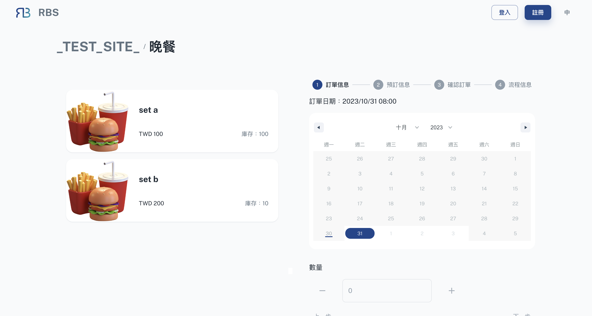
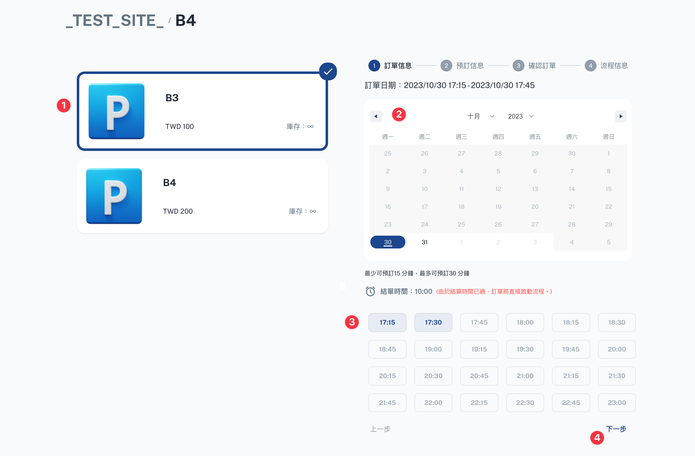
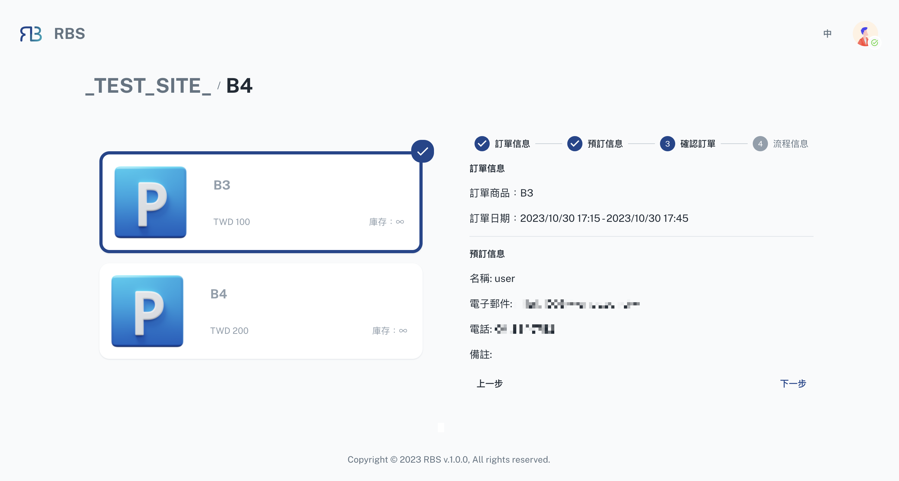

import Tabs from '@theme/Tabs'
import TabItem from '@theme/TabItem'

import BrowserWindow from '@site/src/components/BrowserWindow'

export const url = 'https://10.62.172.106/rbs'

<BrowserWindow url={url}>

</BrowserWindow>

選擇資源後，您將被引導至預訂頁面，您可以在其中輕鬆預訂您選擇的資源。此頁面分為兩個關鍵部分：

---

- 🍎 **品項清單**

  在第一部分「品項清單」中，您可以查看與資源關聯的可用品項。您可以從清單中選擇一項，確保您選擇預訂所需的特定組件。我們簡化 了專案選擇的過程，使您可以輕鬆指定活動所需的確切設備或資源。

---

- ℹ️ **訊息區塊**

  第二部分「訊息區塊」將引導您分三個步驟完成預訂流程（**_如果需要簽核則為四個步驟_**）：

<Tabs>
  <TabItem value="order" label="訂單訊息" default>

<BrowserWindow url={url}>

</BrowserWindow>

在此步驟中，您將選擇預訂的日期、時間和數量。此步驟為您的預訂奠定基礎，確保您指定所需資源的時間和數量。

  </TabItem>
  <TabItem value="reserve" label="預定信息">

  <BrowserWindow url={url}>

</BrowserWindow>

透過「預訂資訊」步驟，您可以選擇作為網站會員（如果已登入）或訪客進行預訂 。

  </TabItem>
    <TabItem value="confirm" label="確認訂單">

<BrowserWindow url={url}>

</BrowserWindow>

此步驟是為了確認您的預訂。它允許您檢查您的選擇並確保所有詳細資訊都是準確的。這是確認預訂之前的最後一步。

  </TabItem>
    <TabItem value="process" label="流程信息（可選）">

<BrowserWindow url={url}>

</BrowserWindow>

如果您的預訂需要簽核，您會在最後找到「流程信息」步驟。在此步驟中，您可以選擇預訂的簽核人，確保您的要求得到必要的審核和授權。

  </TabItem>
</Tabs>
