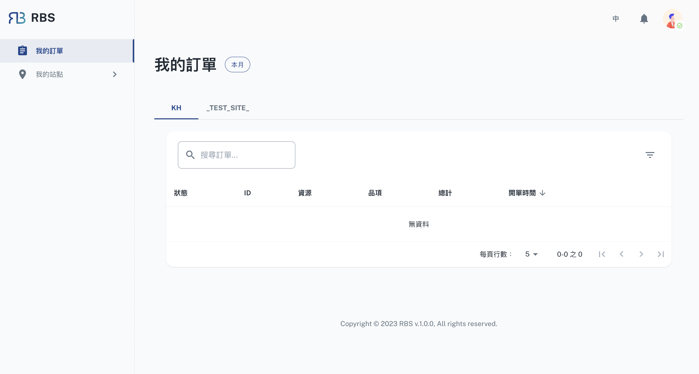

import BrowserWindow from '@site/src/components/BrowserWindow'

export const url = 'https://10.62.172.106/rbs'

<BrowserWindow url={url}>

</BrowserWindow>

歡迎使用顧客(員工)後台，這是您的集中控制中心，可實現高效且使用者友好的資源管理。此後台旨在為您提供無縫且井井有條的體驗，確保您觸手可及所需的所有工具和資訊。

- ✨ 簡化的預訂管理

  顧客(員工)後台使您能夠輕鬆管理資源預訂。無論您是追蹤過去的預訂，還是檢查當前預訂的狀態，「我的訂單」部分都可以提供您預訂歷史記錄。它確保您保持井井有條並了解您的資源分配。

- ✨ 站點互動簡化

  後台上的「我的網站」部分是管理與各個站點互動的入口。它允許您瀏覽與您關聯的站點，從而輕鬆存取對您最重要的資源和資訊。

- ✨ 以使用者為中心的設計

  我們的使用者後台在設計時充分考慮了您的便利性。它提供了一種以用戶為中心的資源管理方法，確保您可以輕鬆存取您的預訂歷史記錄和站點互動。
