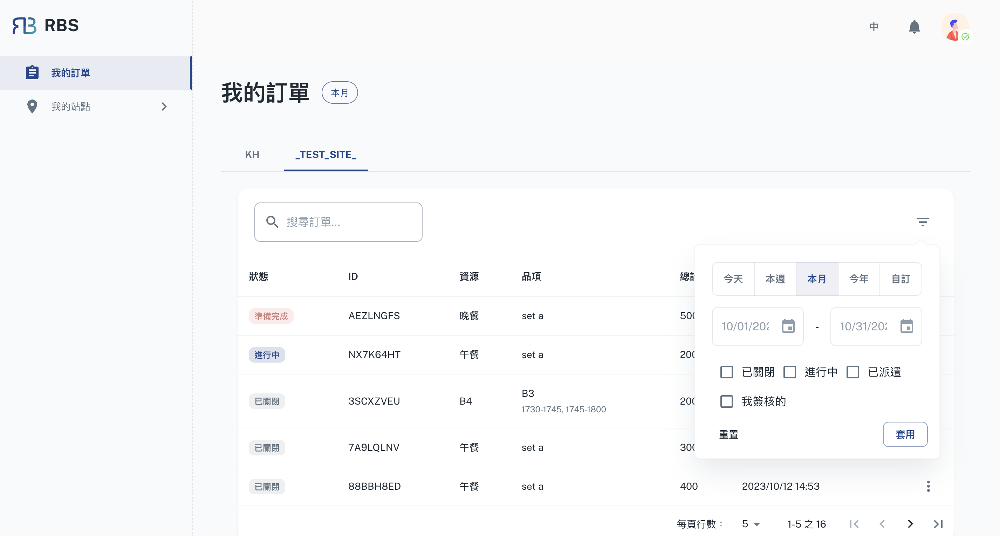

import BrowserWindow from '@site/src/components/BrowserWindow'

export const url = 'https://10.62.172.106/rbs/my-orders'

<BrowserWindow url={url}>

</BrowserWindow>

顧客(員工)後台中的「我的訂單」部分是您瀏覽所有預訂的入口。在這裡，您可以輕鬆存取有關預訂的詳細資訊、查看預訂詳細資訊並根據需要採取特定操作。

- 🗄️ 查看所有預訂

  在“我的訂單”中，您可以查看所有預訂的完整列表，無論是過去的、當前的還是即將到來的預訂。每次預訂都會顯示重要訊息，包括資源、日期、時間以及與預訂相關的任何其他詳細資訊。

- 🔍 過濾和搜尋

  為了簡化您的預訂記錄，「我的訂單」部分可讓您過濾和搜尋特定預訂。您可以使用日期範圍或預訂編號縮小範圍，確保您可以快速找到您有興趣的預訂。

- 🖊️ 管理您的預訂

  對於每個預訂，您都可以選擇透過 more_vert 按鈕執行特定操作。以下是兩個選項：

- ❌ 取消預訂

  如果您需要取消預訂，可以直接從選單中取消。此功能為您的預訂提供了靈活性和控制。

- 👀 查看訂單列表

  選擇此選項，您可以查看也預訂了相同資源的其他人的清單。此資訊對於與使用相同資產的其他顧客(員工)進行協作或協調非常有價值。
