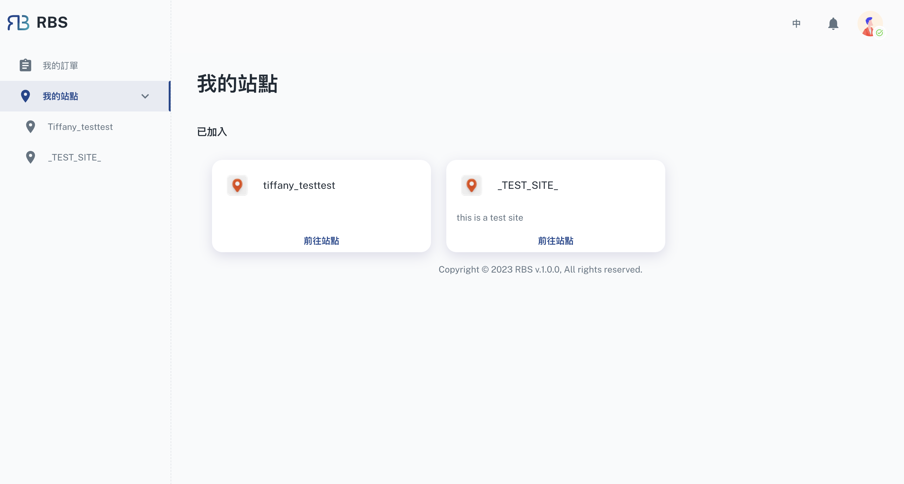

import BrowserWindow from '@site/src/components/BrowserWindow'

export const url = 'https://rbs.ces.myfiinet.com/rbs/my-sites'

<BrowserWindow url={url}>

</BrowserWindow>

您可以在顧客(員工)後台中的「我的站點」部分中有效地管理與各個站點的互動。它提供了一個使用者友善的介面，用於追蹤您的站點成員資格和任何待處理的站點請求。

- 🤝 查看已加入的站點

  在此部分中，您將找到已加入的站點的清單。每個站點都提供了基本信息，使您可以輕鬆識別和訪問您的站點與其會員資格。要查看站點，您只需單擊提供的按鈕即可，該按鈕會將您引導至該站點的專用頁面。

- 🖖 待處理的站點請求

  如果您要求加入其他站點，這些待處理的請求會方便地顯示在「我的站點」部分。對於每個待處理的站點請求，您可以選擇查看請求詳細資訊並追蹤請求的進度。點擊提供的按鈕可讓您存取與待處理請求相關的所有資訊。
